# The Myers Briggs Personality Index (MBTI) Test

The Myers Briggs Personality Index (MBTI) Test, is a psuedo psychology quiz developed during WWII to determine the users' personality groups based on introverted vs extroverted answers over 4 different sections. Based on the work of Carl Jung, it is a popular quiz for people to determine their personality group and though considered redundant professionally, it still provides a good insight to someones traits.

[Visit deployed site](https://jamesbirchall-dev.github.io/MSP2-MBTI-Personality-Test/)

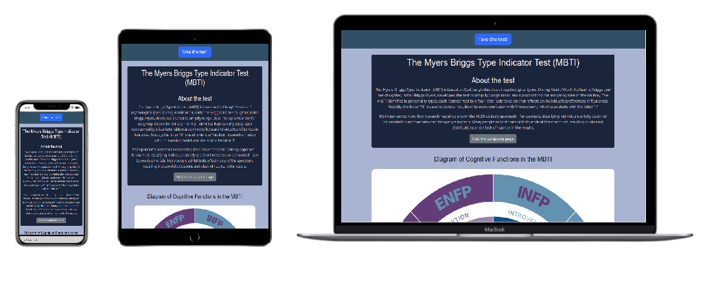

## Table of Contents

- [Scope & Content](#scope--content)

  - [Scope](#scope)
  - [Content](#content)

- [UX](#ux)

  - [User Stories](#user-stories)
  - [User Journey](#user-journey)
  - [Interaction Design](#interaction-design)
  - [Accessibility and Best Practises](#accessibility-amd-best-practises)
  - [Testing and Feedbacl](#testing-and-feedback)

- [Visual Design](#visual-design)

  - [Wireframes](#wireframes)
    - [Index Page](#index-page)
    - [Section Pages (ei.html, sn.html, tf.html, jp.html)](#section-pages-eihtml-snhtml-tfhtml-jphtml)
    - [Section Pages Re-Design Flag](#section-pages-re-design-flag)
    - [Results Page](#results-page)
  - [Fonts](#fonts)
  - [Colors](#colors)
  - [Homepage Styling (index.html)](#homepage-styling-indexhtml)
    - [Navigation](#navigation)
    - [Header Card](#header-card)
    - [Diagram Section](#diagram-section)
    - [Device Scaling](#device-scaling)
  - [Section Pages Styling (ei.html ; sn.html ; tf.html ; jp.html)](#section-pages-styling-eihtml-snhtml-tfhtml-jphtml)
    - [Overview](#overview)
    - [Section 1: Extroversion vs Introversion (ei.html)](#section-1-extroversion-vs-introversion-eihtml)
    - [Section 2: Sensing vs Intuition (sn.html)](#section-2-sensing-vs-intuition-snhtml)
    - [Section 3: Thinking vs Feeling (tf.html)](#section-3-thinking-vs-feeling-tfhtml)
    - [Section 4: Judging vs Perceiving (jp.html)](#section-4-judging-vs-perceiving-jphtml)
  - [Results Page Styling (results.html)](#results-page-styling-resultshtml)
    - [Navigation Bar](#navigation-bar)
    - [Results Section](#results-section)
    - [Personality Type Images](#personality-type-images)

- [Page Elements](#page-elements)

  - [Homepage HTML & CSS Elements (index.html)](#homepage-html--css-elements-indexhtml)
    - [Navigation Bar Section](#navigation-bar-section)
    - [Heading Card Section](#heading-card-section)
    - [Image Section](#image-section)
    - [Index/Homepage Content Diagram](#indexhomepage-content-diagram)
    - [Homepage (index.html) Custom CSS](#homepage-indexhtml-custom-css)
  - [Section pages HTML and CSS Elements (ei.html, sn.html, tf.html, jp.html)](#section-pages-html-and-css-elements-eihtml-snhtml-tfhtml-jphtml)
    - [Navigation Bar Section](#navigation-bar-section-1)
    - [Progress Bar](#progress-bar)
    - [Header Card Section](#header-card-section)
    - [Quiz/Test Form Section](#quiz-test-form-section)
    - [Section Pages HTML Diagram](#section-pages-html-diagram-eihtml-snhtml-tfhtml-jphtml)
    - [Section Pages Custom CSS](#section-pages-custom-css-eihtml-snhtml-tfhtml-jphtml)
  - [Results Page (results.html)](#results-page-resultshtml)
    - [Navigation Bar Section](#navigation-bar-section-2)
    - [Results Section](#results-section-1)
    - [Acknowledgement Message](#acknowledgement-message)
    - [Results Page Diagram](#results-page-diagram-resultshtml)
    - [Results Page Custom CSS](#results-page-custom-css-resultshtml)

- [JavaScript](#javascript)

  - [JavaScript Overview](#javascript-overview)
  - [quiz.js (Loaded on all test/quiz section pages)](#quizjs---loaded-on-all-testquiz-section-pages-eihtml-snhtml-tfhtml-jphtml)
    - [Setup/Load DOM Contents](#setupload-dom-contents)
    - [Progress Initialization](#progress-initialization)
    - [Section Definitions](#section-definitions)
    - [Helper Functions](#helper-functions)
    - [Form Submission (handleSubmit)](#form-submission-handlesubmit)
    - [Card Selection Handling](#card-selection-handling)
    - [Progress Bar Functions](#progress-bar-functions)
    - [Initialization Calls Order](#initialization-calls-order)
  - [results.js (used in final scoring page)](#resultsjs-used-in-final-scoring-page-resultshtml)
    - [MBTI Types Data](#mbti-types-data)
    - [Data Definitions](#data-definitions)
    - [Order on Page](#order-on-page)

- [Testing](#testing)

  - [Manual vs Automated Testing](#manual-vs-automated-testing)
  - [User Testing](#user-testing)
  - [General Testing](#general-testing)
  - [User Stories Testing](#user-stories-testing)
  - [Mobile Testing](#mobile-testing)
  - [Desktop Testing](#desktop-testing)
  - [Lighthouse](#lighthouse)
    - [index.html](#indexhtml-homepage)
    - [ei.html](#eihtml-section-1)
    - [sn.html](#snhtml-section-2)
    - [tf.html](#tfhtml-section-3)
    - [jp.html](#jphtml-section-4)
    - [results.html](#resultshtml-results-page)
    - [Issues Resolution/Acceptance](#issues-resolution-acceptance)
  - [HTML Validation](#html-validation)
    - [ei.html](#eihtml-section-1-1)
    - [sn.html](#snhtml-section-2-1)
    - [tf.html](#tfhtml-section-3-1)
    - [jp.html](#jphtml-section-4-1)
    - [results.html](#resultshtml-results-page-1)
  - [CSS Validation](#css-validation)
  - [JS Hint Validation](#js-hint-validation)

- [Deployment](#deployment)

  - [Local Deployment](#local-deployment)
    - [Local Preparation](#local-preparation)
  - [GitHub Deployment](#github-deployment)
    - [GitHub Instructions](#github-instructions)

- [Credits and Contact](#credits-and-contact)
  - [Content](#content-1)
  - [Contact](#contact)

---

## Scope & Content

### Scope

The purpose of this project is to create an interactive website that utilises javascript for calculation and provides a visual feedback to the user in the UX.
I have chosen a quiz/test format using the Myers Briggs Personality Inidcator Test as a framework for the questioning, with visual feedbacks to the user being on multiple choice color feedback, field validation and a results page which compiles the results for the user.

The sites goal is to be very user friendly using a variety of matching, visually pleasing color schemes and graphics. It should have a very clear journey indicators of where the user is on the journey and provide visual feedback to screen interactions such as clicking answers.

The test was designed during WW2, using the Psychologist, Carl Jung's complicated work on personality types, the test was devised to simplify this down to 16 potential personality types.
The logic is that for each section (4 in total) an Extrovert or Introvert majority answers is determined, each with a unique letter scoring, which leads to a 4 letter score at the end and a 16 total possibility of personality types.
Using google, I compiled the questions into their respective 4 sections, 10 questions per section totalling 40 questions over all.

### Content

Test/Quiz Questions : Section 1: Extraversion vs Introversion.
[Visit Deployed Site](https://jamesbirchall-dev.github.io/MSP2-MBTI-Personality-Test/ei.html)

If 5 or more answers are answer option 1, then the score for the section will be "E"
If 6 or more answers are answer option 2, then the score for the section will be "I"

The same logic is applied to all 4 sections giving a final 4 letter scoring.

For all the questions for each section please refer to my external sheet (https://docs.google.com/spreadsheets/d/1qcxpp5MTfT22Qdgeemm6ImCjR0gg_z4acRIAtPzjFSg/edit?usp=sharing)
Below is an example taken from section 1 only (ei.html):

Scoring:

- Option 1 answers score = E
- Option 2 answers score = I

Q1. At social gatherings, do you:

- Option 1: Enjoy mingling with new people
- Option 2: Prefer deep conversations with a few people

Q2. You feel recharged after:

- Option 1: Spending time with others
- Option 2: Spending time alone

Q3. When thinking something through, you:

- Option 1: Prefer talking it out
- Option 2: Prefer reflecting silently

Q4. In meetings, you're more likely to:

- Option 1: Speak up quickly
- Option 2: Listen and contribute after thinking

Q5. When you wake up on a weekend, you:

- Option 1: Look forward to plans with others
- Option 2: Look forward to time to yourself

Q6. When introduced to a new group, you:

- Option 1: Introduce yourself and ask questions
- Option 2: Wait to be approached

Q7. On vacation, you prefer:

- Option 1: Group activities and exploring
- Option 2: Relaxing on your own terms

Q8. You tend to:

- Option 1: Share your thoughts easily
- Option 2: Keep thoughts to yourself unless asked

Q9. Your ideal workday includes:

- Option 1: Frequent collaboration
- Option 2: Long stretches of solo work

Q10. People would describe you as:

- Option 1: Outgoing and energetic
- Option 2: Quiet and thoughtful

Section 2: Sensing vs Intuition
Section 3: Thinking vs Feeling
Section 4: Judging vs Perceiving.

The site will be split into 3 main journey steps:

- Homepage
- Quiz/Test (4 x sections)
- Results Page

## UX

### User Stories

1. I want to learn about the history of the MBTI.
2. I want to understand the results before starting the test.
3. I want access to external sources.
4. I want to easily start the test.
5. I want validation if questions are skipped.
6. I want the test to work on all devices.
7. I want to return to the homepage easily.
8. I want the site to be visually accessible.

### User Profile

As the test/ quiz is a fun activity, the site should try to cater to as broad an audience as possible so it is important to keep the information brief and clear, and provide plenty of interactivity and visual queues to keep the user engaged.

### User Journey

The main purpose of the site is to provide the user with an interactive and interesting quiz whilst also providing some accessible understanding and learning about the quiz beforehand.

Therefore I chose a linear approach with the user journey and navigation.

The homepage should have clear information and taking the test should be in landing view on the page.

The test itself should be very clickable with plenty of screen interaction and feedback, guiding the user through each section, keeping the user informed of progress.

Ending up on the results page which should provide structured and clear results.

All pages except the index page should have the ability to return to the homepage and repeat the journey.

### Interaction Design

The primary interaction will be on the test/quiz section pages, with 4 sections, 10 questions per section. Each question will have a 2 option answer via use of radio buttons on cards.

As the test’s results are based on the total outcome of opt 1 v opt 2, I’ve decided to incorporate custom colors to update via CSS using Javascript upon user selection and use Bootstrap with custom CSS for form validation feedback.

I will also add a progress bar which feeds back live to the user.

The home page and results page will have clickable, external links that open in a new tab in the web browser, with appropriate acknowledgements to the sources.

### Accessibility and Best Practises

Font chosen (Primary: Montserrat, sans-serif ;Secondary: Varela, sans-serif ) as is clear and well spaced & curved making this beneficial to people with learning difficulties such as dyslexia.

Best practises in design using clear and interactive navigation, good contrast with foreground vs background and use a color scheme that is dynamic and stylish. This is to be complimented with clear and structured sections in the pages.

Lighthouse testing and resolution to ensure accessibility and best practices throughout the site.

### Testing and Feedback

Ensure positive user experience through continuous and thorough testing during and and upon completion of the website.

Also to test via friends and peers within my learning group and ensure smaller devices are heavily tested in particular.

## Visual Design

### Wireframes

####

#### Index Page

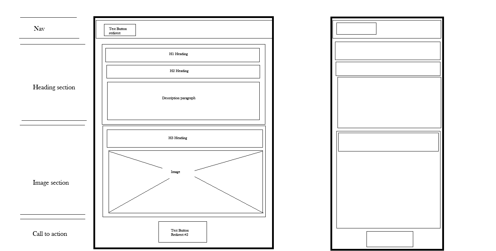
[Visit deployed site](https://jamesbirchall-dev.github.io/MSP2-MBTI-Personality-Test/)

#### Section Pages (ei.html, sn.html, tf.html, jp.html)

[Visit Deployed Site](https://jamesbirchall-dev.github.io/MSP2-MBTI-Personality-Test/ei.html)

#### Section Pages Re-Design Flag:

The initial design had a single page for the test/quiz and was 70 questions long. It became clear during construction that this was poor UX so I decided to split it into the 4 pages corresponding to the different sections/pages.
The commit that corresponds to this is :
"added:redesign UX :html files to split existing sections to different pages"

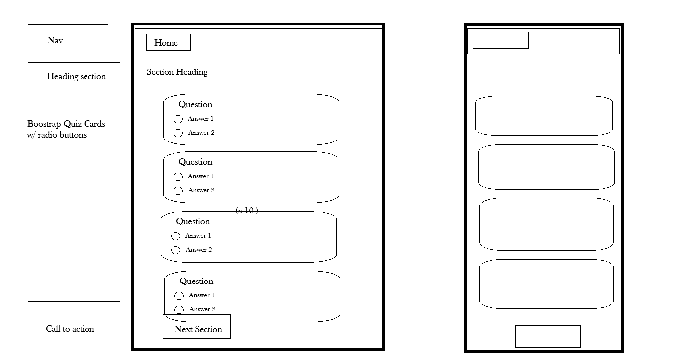

#### Results Page

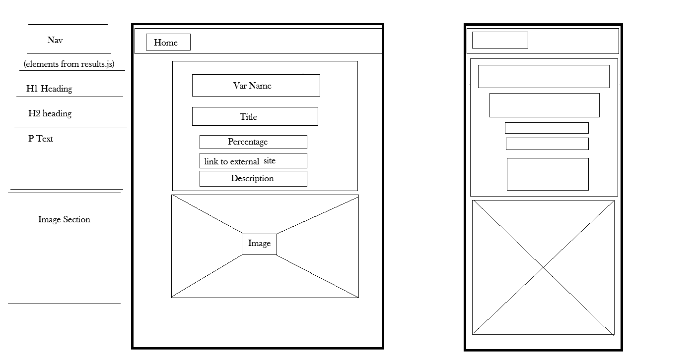

### Fonts

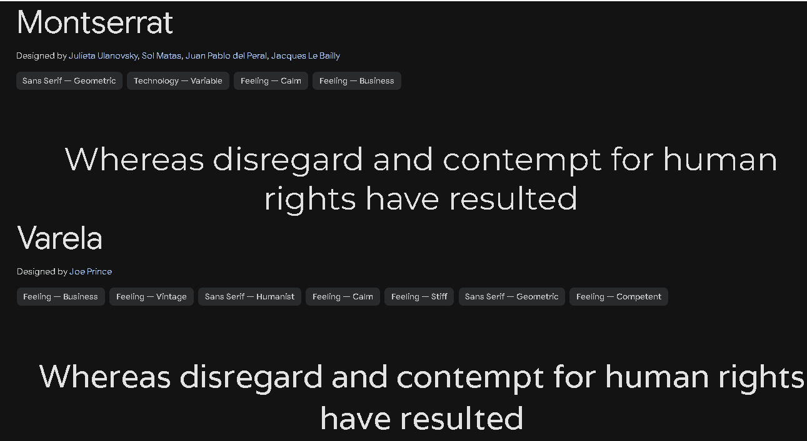

- **Primary:** `Montserrat`, sans-serif – Bold and accessible for headings
- **Secondary:** `Varela`, sans-serif – Clean and minimalist for paragraph text

### Colors

- Based on MBTI diagram used across multiple platforms
- Accessible color scheme with light backgrounds and high contrast

### Homepage Styling (index.html)

[Visit deployed site](https://jamesbirchall-dev.github.io/MSP2-MBTI-Personality-Test/)

The index/ homepage's purpose is to simplisticly deliver information about the history, the purpose and the meaning of the test and the results. This is acheived through:

#### Navigation

- Direct required on this page is to take the test. (ei.html)
- Simplistic Bootstrap nav, utilising the primary color #315166; A dark and greyed green to provide good contrast against the bold-blue bootstrap primary button class .

#### Header Card

Acheives a high contrast color ratio for reading, content is displayed centrally to keep buttons and content inline on page, allows for better device scaling and smaller device interaction as well:

- Utilised bootstrap card https://getbootstrap.com/docs/5.3/components/card/.
- White writing on a custom css dark blue background for accessibility, displays H1 and H2 headers with a P section which is used for a summary of the tests' history along with a secondary bootstrap button class which redirects the user to the external wiki page (in new tab).
- Centre aligned content (whole page) for uniformity and for easy device scaling and scrolling,

#### Diagram Section

- H3 Header section very dark blue text against secondary color background for contrast.
- Bootstrap secondary button for additional page direct to take the test. (ei.html)
- External Diagram image showing a map of the personality types against their introvert vs extrovert sections.
- Small inline block text box for acknowledgment of 3rd party image source.

#### Device Scaling

- Bootstrap and container classes utilised to scale content proportionatly. Custom CSS media queries to determine image width for 480px and 768px ,

Laptop, Tabelt and Mobile Views:

[Visit deployed site](https://jamesbirchall-dev.github.io/MSP2-MBTI-Personality-Test/)

### Section Pages Styling (ei.html ; sn.html ; tf.html ; jp.html)

#### Overview

The section pages are 4 seperate sections of the test to be taken by the user. Each section will determine a letter as a result to be compiled in the final results.html page.

Navigation:

- Same styling as Homepage nav except the link (Home) alignment is to the left and aligned with the test/ quiz content below and the navbar is sticky with the progress bar.

Progress Bar:

- custom inline CSS progress bar with boostrap blue also remains sticky with the navbar so the user can always see the interaction update where ever they are on the page.

- Same colors and alignment as the Header card on the index/home page.
- H1 Header "The Myers Briggs Type Inidicator Test" fixed on all section pages.
- H2 Header - custom per section and utilises the root variants via span classes (more info in following sextions)
  - extraversion-color: #d9abfa
  - introversion-color: #9ad0f5
  - sensing-color: #71be95
  - intuition-color: #d8c1e9
  - thinking-color: #f0b8c9
  - feeling-color: #61a4d1
  - judging-color: #d67078
  - perceiving-color: #6dd6a0

Form section (Test/Quiz):

- Utilising bootstrap card and card body for the layout with input classes, names, ids and values to be used with javascript for scoring and css for visual interaction.
- Radio input for option 1 and 2 responses.
- Custom card background color _ see following sections for more information_
- Bootstrap validation (needs-validation) implemented.

Override in style.css for validation - check - vald. Changed from green to white to allow better contrast vs the following custom card background colors:

#### Section 1: Extroversion vs Introversion (ei.html)

[Visit Deployed Site](https://jamesbirchall-dev.github.io/MSP2-MBTI-Personality-Test/ei.html)

These are stlying choices that relate to the specific section.

- Progress Bar defaults to 0% when page is loaded.
- "Extraversion (E)" and "Introversion (I)" H2 Text custom css root color variants determined using span class in H2 Headings:

  - extraversion-color: #d9abfa
  - introversion-color: #9ad0f5

- Upon answer selection, the card's background updates to the assigned color (option 1 is extraversion color and option 2 is introversion on this page).
- Linear gradient utilised on card selection in order to allow a black gradiant to the assigned color from left to right. This is to ensure the text is still legible after selection. Should the user choose to revise their answer. Source: (https://www.w3schools.com/css/css3_gradients.asp)

#### Section 2: Sensing vs Intuition (sn.html)

- Progress Bar defaults to 25% when page is loaded.
- "Sensing (S)" and "Intuition (N)" H2 Text custom css root colorvariants determined using span class in H2 Headings:

  - sensing-color: #71be95
  - intuition-color: #d8c1e9

- Upon answer selection, the card's background updates to the assigned color (option 1 is sensing-color and option 2 is intuition-color on this page).
- Linear gradient utilised on card selection in order to allow a black gradiant to the assigned color from left to right. This is to ensure the text is still legible after selection. Should the user choose to revise their answer. Source: (https://www.w3schools.com/css/css3_gradients.asp)

#### Section 3: Thinking vs Feeling (tf.html)

- Progress Bar defaults to 50% when page is loaded.
- "Thinking (T)" and "Feeling (F) " H2 Text custom css root colorvariants determined using span class in H2 Headings:

  - thinking-color: #f0b8c9
  - feeling-color: #61a4d1

- Upon answer selection, the card's background updates to the assigned color (option 1 is thinking-color and option 2 is feeling-color on this page).
- Linear gradient utilised on card selection in order to allow a black gradiant to the assigned color from left to right. This is to ensure the text is still legible after selection. Should the user choose to revise their answer. Source: (https://www.w3schools.com/css/css3_gradients.asp)

#### Section 4: Judging vs Perceiving (jp.html)

- Progress Bar defaults to 75% whn page is loaded.
- "Judging (J) and Perceiving (P)"" H2 Text custom css root color variants determined using span class in H2 Headings:

  - judging-color: #d67078
  - perceiving-color: #6dd6a0

- Upon answer selection, the card's background updates to the assigned color (option 1 is judging-color and option 2 is perceiving-color on this page).
- Linear gradient utilised on card selection in order to allow a black gradiant to the assigned color from left to right. This is to ensure the text is still legible after selection. Should the user choose to revise their answer. Source: (https://www.w3schools.com/css/css3_gradients.asp)

### Results Page Styling (results.html)

#### Navigation Bar

Same NavBar as the homepage applied with only change is that the Button is named "Home" and redirects the user back to the Homepage (index.html)

#### Results Section

The results page's purpose is to show the user their personality test results with a 4 letter scoring taken from each section. The example below is a result for ESFP which means in:

- Section 1: scored E (Extraversion)
- section 2: scored S (Sending)
- Section 4: scored F (Feeling)
- Section 4L scored P (Perceiving)
- Giving the total concatination of letter: ESFP

Predetermined as const types in the results.js const types, the following fields are populated using JS:

- type (eg. ESFP)
- title (eg. The Entertainer)
- percentage (eg. 8.7%)
- description (eg "Extraverted, Observant, Feeling, and Prospecting")
- Site (external link to personality pagee)
- External image (Media query for device set in javascript const types)

#### Personality Type Images

Sourced from (https://16personalities.com)

Below are the different images loaded depending on the personality score.

ISTJ

ISFJ

INFJ

INTJ

ISTP

ISFP

INFP

INTP

ESTP

ESFP

ENFP

ENTP

ESTJ

ESFJ

ENFJ

ENTJ

## Page Elements

### Homepage HTML & CSS Elements (`index.html`)

[Visit deployed site](https://jamesbirchall-dev.github.io/MSP2-MBTI-Personality-Test/)

#### Navigation Bar

- nav - Bootstrap navigation container (basic)
- py3 - Bootstrap - vertical padding 1rem top & bottom.
- mb-4 - Adds Bottom margin for space to the header card.
- container - center and contains width of content.
- btn-primary btn-lg - Blue themed Large Button direct to test/quiz page.

#### Heading Card Section

- container - alignement and responsive.
- card - Bootstrap component:
- card-header - Top section of card used for H1 Heading
- card-body - Main paragraph text body
- card-title - H2 Heading sub heading.
- card-text - paragraph styling within the card-body
- btn-secondary - secondary gray color directing user to external link (wiki page in new tab)

#### Image Section

- text-center - horizontal text centre alignment
- pt-3, pt-5 - Top and Bottom padding respectively.
- container - keeps section content contained.
- mb-4. mb-3 - bottom margin for spacing.
- btn-secondary - secondary gray color directing user to test (ei.html)
- img-fluid - to make image responsive to size.
- rounded-4 - adds rounded corners
- d-inline-block - to allow padding and margin.
- px-2, pt-1 - x and y padding.

#### Index/Homepage Content Diagram

#### Homepage (`index.html`) Custom CSS

Global Values:

- Google Font Import ( Monsterrat )
- root variables (colors and fonts)
- body - for font family, primary & secondary colors and background color
- h1,h2,h3 headings to secondary font (varela), dark text (rgb 2,18,29) and center alignment.
- index page container - applies centre alignment for index page only.

NavBar:

- Background color applies var(--primary-color) with white text.

Image Section.

- .image-section - background color (var(--secondary-color)) text color rgb(16,12,19).
- .image-section img - sets width 100%, height: auto and max width 800px for responsivity and reduce large size shifts with larger screens.
- Media queries for smaller screens: (@media) - adjust .image-section img for screens ≤768px (90%, max-width: 500px) and ≤480px (100%).

### Section pages HTML and CSS Elements (ei.html, sn.html, tf.html, jp.html)

#### Navigation Bar

- Classes:
  - sticky-nav-wrapper - custom wrapper for sticky nav only applied to the section pages.
  - nav - Bootstrap basic class
  - py3 - Bootstrap - vertical padding 1rem top & bottom.
  - mb-0 for no bottom margin.
- Inner container div class to center content and add horizontal padding.
- btn-primary btn-lg - Blue themed Large Button direct to home/index page.

#### Progress Bar

- container - for alignment and padding
- enclosed in nav container so this remains sticky with the navbar.

#### Header Card Section

- container - Bootstrap container for layout.
- header-container: custom class, probably for spacing or header-specific styling.
- card- Bootstrap card component.
  - card-header: styles the header area of the card.
  - card-body: content area of the card.
  - card-title: styles the main title in card body.
- Span text (for example with ei.html):
  - extraversion-text and introversion-text: custom color for text colors for these words to match the card selection color change detailed below.
  - same logic applied for other sections so sn.html will have sensitivity-text and intuition-text and color var's to match.

#### Quiz/ Test Form section

General:

- needs-validation: Bootstrap validation class
- novalidate - disables native html validation for Bootstrap.

Question Cards:

- card - Bootstrap card for each question.
- card-body - content wrapper for question.
- form-check - Bootstrap class for checkbox/radio wrapper.
- form-check-input - styles the radio button input.
- form-check-label - styles the label for the radio button.
- invalid-feedback - Bootstrap validation message shown when input invalid.

Validation Message:

- "div id="validation-message" class="text-danger mt-3" style="display: none">
  Please answer all questions before continuing."
- text-danger: Bootstrap class to make text red.
- mt-3: margin-top of 3 units.
- Hidden by default (display: none), shown by JS if form incomplete.

Submit/ Next Section Bootstrap Button:

- btn - base Bootstrap button.
- btn-primary - primary color styling.
- btn-lg - large size.
- active - gives button a pressed/active state styling.

#### Section Pages HTML Diagram (ei.html, sn.html, tf.html, jp.html)

#### Section pages custom CSS (ei.html, sn.html, tf.html, jp.html)

Google Fonts
"@import url("https://fonts.googleapis.com/css2?family=Montserrat:ital,wght@0,100..900;1,100..900&display=swap");"
Imports the Montserrat font from Google Fonts.

CSS Variables (:root):

":root {
--primary-font: "Montserrat", sans-serif;
--secondary-font: "Varela", sans-serif;
--primary-color: #315166;
--secondary-color: #a8b4d3;
--extraversion-color: #d9abfa;
--introversion-color: #9ad0f5;
--sensing-color: #71be95;
--intuition-color: #d8c1e9;
--thinking-color: #f0b8c9;
--feeling-color: #61a4d1;
--judging-color: #d67078;
--perceiving-color: #6dd6a0;"

- Variables make it easy to maintain consistent colors and fonts.
- Each MBTI dimension has its own color variable for highlighting selected answers.
- primary-color and --secondary-color are used for general page theming.

Body & Typography:

"body {
font-family: var(--primary-font);
color: var(--primary-color);
background-color: var(--secondary-color);
}

h1, h2, h3 {
font-family: var(--secondary-font);
color: rgb(2, 18, 29);
text-align: center;
}"

- Sets the global font and page background.
- Main headings use secondary font and center alignment.

Navbar & Sticky Header

.custom-navbar {
background-color: var(--primary-color);
color: white;
}

.sticky-nav-wrapper {
position: sticky;
top: 0;
z-index: 1000;
}

- .custom-navbar overrides default Bootstrap colors.
- .sticky-nav-wrapper ensures the nav bar sticks to top of page.

Progress Bar

"#overall-progress-bar {
width: 0%;
height: 20px;
background-color: #007bff;
transition: width 0.3s ease;
}

#progress-container {
width: 100%;
background-color: white;
height: 20px;
border-radius: 10px;
margin-bottom: 1.5rem;
overflow: hidden;
}"
"

- Styles the progress bar and its container.
- Smooth width transition when updating progress.

Image Section

".image-section {
background-color: var(--secondary-color);
color: rgb(16, 12, 19);
}

.image-section img {
width: 100%;
height: auto;
max-width: 800px;
}
"

- Sets background and text for image areas.
- Makes images responsive with max-width.
- Responsive breakpoints adjusts image width for tablets and mobile screens.
  - @media (max-width: 768px) { .image-section img { width: 90%; max-width: 500px; } }
  - @media (max-width: 480px) { .image-section img { width: 100%; } }

Quiz Form

"#quiz-form {
max-width: 700px;
margin: auto;
padding: 1rem;
}

#quiz-form .form-check-label:hover {
cursor: pointer;
transition: color 0.3s ease;
}"

- Centers quiz form and limits width.
- Adds hover effect for options.

Card Styling

".card {
margin-bottom: 1rem;
color: rgb(255,255,255);
background-color: rgb(20,31,51);
font-size: 1rem;
font-weight: 300;
}

.card h1 {
color: rgb(245,231,231);
}"

- Dark themed cards with white text.
- h1 inside cards slightly lighter.

Selected Card Gradients

.card.e-selected { background: linear-gradient(135deg, rgba(0,0,0,0.25) 0%, var(--extraversion-color) 100%); opacity: 0.9; }
/_ same pattern repeated for i,s,n,t,f,j,p _/

- Applies distinct gradient colors when an answer is selected.
- Ensures sufficient contrast for text readability.

Form Validation

".was-validated .form-check-input:valid ~ .form-check-label {
color: white;
}

#validation-message {
margin-bottom: 1.2rem;
text-align: center;
font-weight: bold;
font-size: 1.1rem;
color: #dc3545;
}
"

- Ensures labels stay readable when options are validated.
- Centers error/validation messages.

### Results Page (results.html)

#### Navigation Bar Section

- nav - Bootstrap navigation container (basic)
- py3 - Bootstrap - vertical padding 1rem top & bottom.
- mb-4 - Adds Bottom margin for space to the header card.
- container - center and contains width of content.
- btn-primary btn-lg - Blue themed Large Button direct to homepage.

#### Results Section

- container class - to ensure responsive layout.
- card results-card class - for custom css for the results page card.
- card:
  - card-header:
    - Bootstrap componenent card header use for default padding.
    - H1 main heading #type span will be populated dynamically with JS.
  - card-body - Bootstrap componenet used for default padding.
  - H2 id="title" - used to populate from result.js script.
  - ht-3 to add 1rem margin top.
- Population and descripion:
  - paragraph p tags
  - strong tag for bold text emphasis
  - span elements for dynamic js content from result.js
- External Link
  - id site link used from results.js for specific personality type page.
  - a tag link opens in new window.
- Results Image:
  - resultImage id - targeted by JS from results.js
  - img-fluid my-4 - Bootstrap class for responsive image scale and top/bottom margin
  - width/height to set intrinsic image size.
  - style = max-width - for scaling images.
  - eager loading - lighthouse flag prevention for lazy/ long loading time.

#### Acknowledgement Message

- "p class="mb-3" - Bootstrap margin-bottom = 1rem.
- span class="d-inline-block bg-light text-dark px-2 py-1 rounded">" Bootstrap utility classes:
  - d-inline-block - displays span as inline-block.
  - bg-light - light background color.
  - text-dark - dark text.
  - px-2 py-1 - padding X = 0.5rem, padding Y = 0.25rem.
  - rounded - small border-radius (rounded corners).
  - small - smaller text.

#### Results page Diagram (results.html)

#### Results page custom CSS (results.html)

Global & Variables:

- :root - Defines all CSS variables (fonts, colors, MBTI colors).
- body:
  - font-family: var(--primary-font) - Montserrat
  - color: var(--primary-color) - dark blue-gray text
  - background-color: var(--secondary-color) - light blue-gray background

Headings
h1, h2, h3:

- font-family: var(--secondary-font) (Varela fallback)
- color: rgb(2,18,29) (dark)
- text-align: center

But inside .card:

- .card h1 - overrides h1 color - light text rgb(245,231,231)

Navbar

- .custom-navbar
- background-color: var(--primary-color)
- color: white

Cards

- .card (applies to .results-card because it inherits .card)
- margin-bottom: 1rem
- color - #fff (sets text color)
- background-color - rgb(20,31,51) (dark background)
- font-size - 1rem; font-weight: 300

\*\* But then overridden by .results-card:

- text-align: center
- background-color: #3e8656 (green background instead of dark navy)
- .results-card h2 - color: white
- .results-card a - color: blue; text-decoration: underline

Image - #resultImage:

- aspect-ratio: 1046/516
- width: 100%; height: auto
- display: block
  (Bootstrap img-fluid also applies - responsive scaling)

Container Adjustments (Results Page Only .results .container:

- text-align: center
- max-width: 700px
- margin: 0 auto

## Javascript

### Javascript Overview

The quiz.js file is the prodominant js used on the site as it is used for handling validation, progress bar, score counting and storage and some custom card background css which is conditional on option 1 or 2 selection. The results.js is essentially only used to store the fixed const metadata for the different scoring possibilities, and populate the specific content to the results page.

### quiz.js - Loaded on all test/quiz section pages (ei.html/ sn.html/ tf.html/ jp.html)

#### Setup/ Load DOM Contents

- form
- sectionKey obtained from body data-section="section1", "...section2" etc.
- validation message element (bootstrap validation)
- constant definitions:
  - totl_questions = 40 (4 x sections of 10 questions)
  - progress_key = "questionsAnswered" session storage for the 4 sections of 10 questions.

#### Progress Initialization

Primarily use for progress bar to default to the correct percentage on each section. If the user is on:
(40 Questions in Total)

- section 1, sets to 0/40
- section 2, sets to 10/40
- section 3, sets to 20/40
- section 4, sets to 30/40

  As the user journey and form validation do not allow skipping of sections, the primary use for these vars are to set the progress bar at the correct value as the format of the quiz/test form over different pages led to issues with saving the progress via storage in testing.

#### Section Definitions

- valueMap - which two letters the section measures (eg section 1 = E vs I)
- nextPageMap - which page to go to after the present one.
  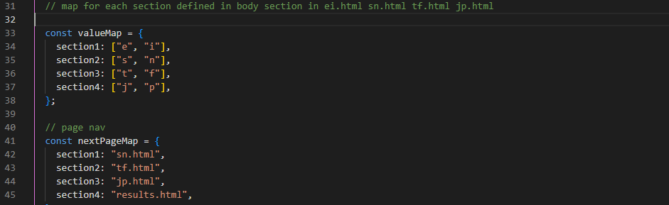

#### Helper Functions

- Counts how many answers were option 1 or option 2 (for example with section 1: Option 1 = "E" and option 2 = "I") getFormDataCounts (formData, firtLetter, secondLetter).

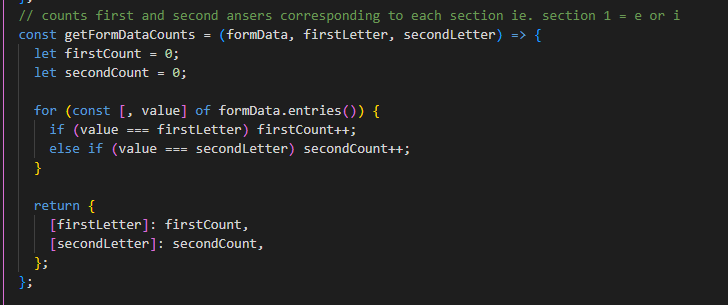

- validateForm(form)

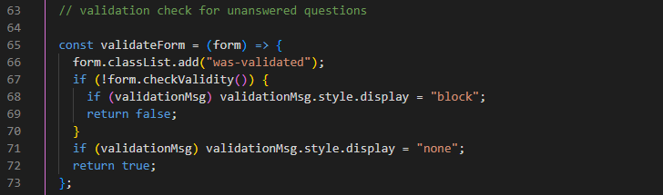

- was-vallidated class bootstrap link: Checks if all required answers are filled and shows/ hides validation message based on this.

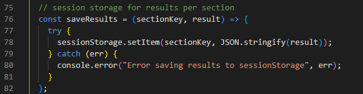

- saveResults (sectionKey, result): Saves the result into storage (for example: e: 6, i: 4 for section 1 meaning 6 x option 1s were answered and 4 x option 2s).

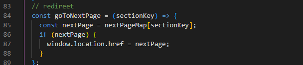

- goToNextPage(sectionKey): directs the browser to the next page. \*\* essential JS does this over HTML as HTML will load before the JS and could break the session.

#### Form Subission (handleSubmit)

- Prevents standard form submission.
- Validates answers (backup to bootstrap function)
- Collects answers/ response -counts with getFormDataCounts.
- Saves results in sessions storage.
- Redirects to the next section page.

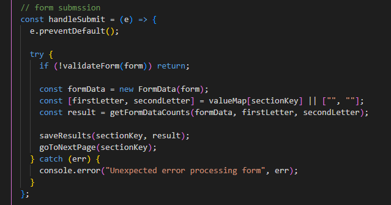

#### Card Selection Handling ( to update card background color based on selection)

    For .card:

- Listener for radio button change
- Removes selection highlight css class.
- Adds selection classes: eg. "e-selected, i-selected etc." for css to color the card.
- Updates updates global answered count. incrementGlobalProgress
- Updates section progress.

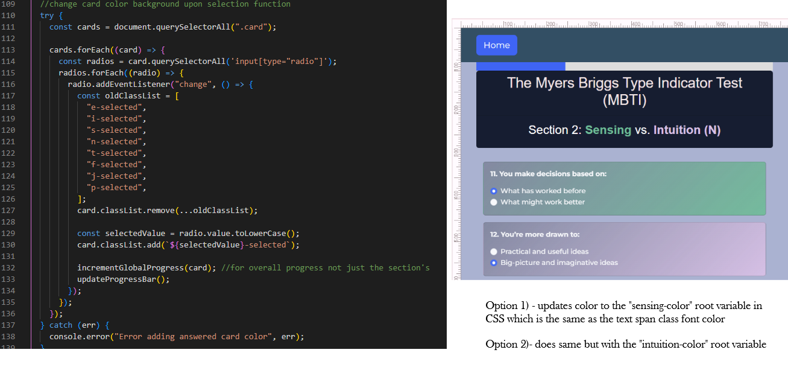

#### Progress Bar Functions

- updateProgressBar : per-section progress %
- getQuestionsAnswered : total questions answered (from sessionstorage)
- saveQuestionsAnswered: save total answered count.
- incrementGlobalProgress: increments once per card.
- updateOverallProgressBar: updates the global progress bar accross all sections.

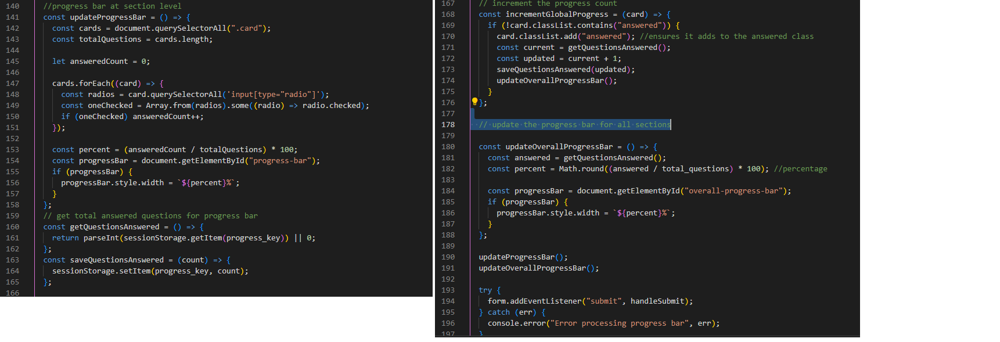

#### Initialization Calls Order

- 1. Setup variables.
- 2. Initialize progress
- 3. Define helper maps
- 4. Define functions
- 5. Attach event listeners
- 6. Initialize progress bars.

### results.js used in final scoring page (results.html)

Used to define data based on the scoring values from the test/quiz.

#### MBTI types data

- Defines personality score using type, broken down into 16 possible scorings and storing the following values to populate in the results.html page:
  - title
  - percentage
  - descrtipion
  - external site link
  - images (multiple for mobile, tablet and desktop sizes)
  - media query function

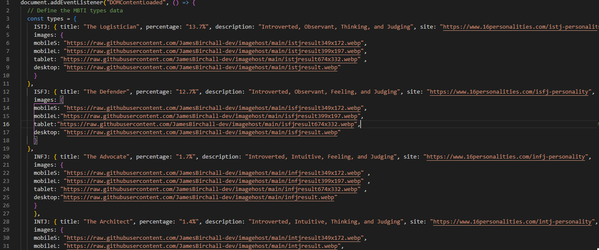
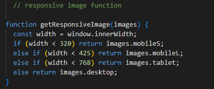

#### Data definitions

- reads results from sessionStorage

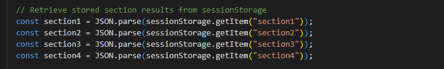

- handles missing data (bootstrap does this function via validation but in place as a backup).

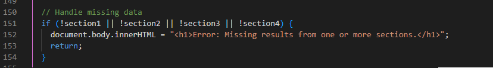

- determines a score like "ESFP" to match the MBTI const type. (Option 1 is the dominant trait option so if even score, it will default to option 1)

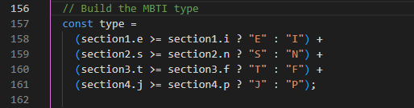

- displays title, description, percentage, link and image per device.

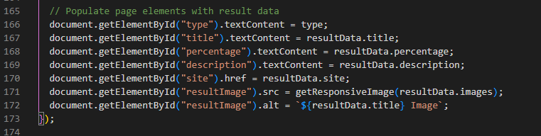

#### Order on page

- 1.  Wait for DOM ready
- 2.  Define all 16 MBTI metadata.

## Testing

### Manual vs Automated Testing

Manual testing's advantage would be to consollidate the test process with both the User Testing and script testing. The reason's for manual use on this site are as follows:

- User journey possibilities with javascript are quite linear:
  - 2 option answer question format
  - Each section determines if option 1 or 2 was more dominant
  - Session saves the score for each section.
- Same applies with validation, progress bar and background css card change.

Automated test scripts would be more appropiate if the questions and answers were more dynamic and randomised. And where all the possibilities of the interractions could be quickly written as test scripts and ran in the fraction of the time a user could.

Overall, as the site requires user testing anyway and the outcome possibilities can be easily acheived with the same process, the overall choice is to manually test the whole site without the need for test scripts.

### User Testing

[Link to original test google sheet](https://docs.google.com/spreadsheets/d/11xpqVesGR65-1Q08XUiEP1586WY4H_mNPPlIM7DmkEs/edit?usp=sharing)

### General Testing

- The site was sent to friends for feedback and testing.
- All forms have validation and will not submit without the proper information.
- Youtube Video embed functionality tested.
- Map interaction controls fully tested.
- External links open in a new tab.
- Font and color placement.
- Image resolutions intrinsic vs rendered checekd.
- Adhoc troubleshooting with the aid of Code Institute Network and https://www.stackoverflow.com.

### External Testing and Peer Review

The site has been sent to close friends and family members, and tested on both iphone and android mobile devices with no issues reported.

General feedback is that the site was comfortable and visually stimulating to play around with as well as informative.

Sent the website to class mates with primmary feedback received from Greg and David in my September '24 Runshaw College Level 5 Web App Diploma class.

Greg "The test looks great it’s very unusual, and I’ve never heard of a personality test like this before. I’ll share it with my wife, as I believe she’s the complete opposite.
The colors look good, and the page is responsive. I tested it on my iPhone 13, both vertically and horizontally."

David "I just had a play with your project. Very interesting and it worked well. It was informative. I didn’t have any issues when completing the test."

### User Stories Testing

1. I want to learn about the history of the MBTI.

- Homepage header card provides background and information about the test.

2. I want to understand the results before starting the test.

- MBTI Diagram image as well as Wikipedia link provides overview of this.

3. I want access to external sources.

- Acheived via wikipedia links in the homepage and also the 16personalities link at the results page.
  

4. I want to easily start the test.

- Acheived via homepage with button#1 in the navigation to be in landing view, then also button#2 below the image for scrolled-down access.

5. I want validation if questions are skipped.

- Bootstrap validation and backup javascript applied to the test pages. Also backup Javascript validation in quiz.js should this fail.
  

6. I want the test to work on all devices.

- As well as a simple layout. Also utilised bootstrap classes and media queries to scale easily.
  Device view Laptop, Tablet and Mobile.
  
  
  

7. I want to return to the homepage easily.

- Homepage button in all non-index pages in the navigation.
  

8. I want the site to be visually accessible.

- simple design with well contrasted background vs foreground. Lighthouse accessibility good scores.
  Device view Laptop, Tablet and Mobile.
  Please see lighthouse testing section for accessibility score.
  
  
  

### Mobile Testing

- I tested the site personally on my Android Galaxy S24 device, going through the entire process, checking buttons, functions out, etc. I was personally unable to test on iOS.
- The site was sent to friends and relatives for them to follow the same process. They have tested on their devices, including iOS.
- Chrome was utilised to inspect the site in mobile format, going through the pages and functions.

### Desktop Testing

- The majority of testing occurred on Chrome.
- The site was tested by friends and relatives on numerous desktop devices.
- The sites functionality and navigation have been tested on Chrome, Firefox and Edge.
- Internet Explorer was not tested and the site was not developed with it in mind as support for the browser is gradually being dropped.

### Lighthouse

Any remaining flags in the lighthouse reports are due to external sources so are neglegible for the purposes of this project.
In particular, the Best Practises score on Index page are due to the 3rd party image from wikipedia.

#### index.html (Homepage)

Desktop

Mobile

#### ei.html (section 1)

Desktop

Mobile

#### sn.html (section 2)

Desktop

Mobile

#### tf.html (section 3)

Desktop

Mobile

#### jp.html (section 4)

Desktop

Mobile

#### results.html (Results Page)

Desktop

Mobile

#### Issues Resolution/ Acceptance

Issue 1: background vs foreground text low contrast
Acceptance Reason: text is for legal purposes only, no impact to UX.

Issue 2: Issues logged in panel
Acceptance Reason: 3rd Party Cookie - not in scope.

Issue 3: explicit height and width not set
Resolution: set explicit width and height to images on index & results page.
Commit message: "lighthouse fix: index, results page - explicit height and width"

Issue 4: background vs foreground contrast issue on results page for external link.
Resolution: Updated the link text to white to provide contrast.
commit message: "update readme. update results.html link background color (lighthouse)"

Issue 5: large layout shifts on page. Caused by conflicting bootstrap fluid class against custom css and min-height not determined in paragraph.
Resolution: Remove bootstrap fluid class from results.html, add custom css for #paragraph for min height.
commit message: "results pararaph. add min-height css. Removed fluid class from results page image"

### HTML Validation

All html files have been checked using w3c school validater check via direct input. (https://validator.w3.org/detailed.html)
Screenshots for each page:

#### index.html (Homepage)

#### ei.html (section 1)

#### sn.html (section 2)

#### tf.html (section 3)

#### jp.html (section 4)

#### results.html (Results Page)

### CSS Validation

All css files have been checked using w3c validation https://jigsaw.w3.org/css-validator.
Screenshot for style.css:

### JS Hint Validation

All .js files have been checked using the JS Hint validation service, this has been configured with additional ES6 to support new Javascript features.

quiz.js:

results.js:

## Deployment

### Local Deployment

#### Local Preparation

**Requirements:**

- An IDE of your choice, such as [Visual Studio Code](https://code.visualstudio.com/)
- Github Account

### Github Deployment

#### Github Instructions

1. Log in to your GitHub account.
   navigate to [(https://github.com/JamesBirchall-dev/MSP2-MBTI-Personality-Test](https://github.com/JamesBirchall-dev/MSP2-MBTI-Personality-Test).
1. You can set up your own repository and copy or clone it, or you fork the repository.
1. `git add`, `git commit` and `git push` to a GitHub repository, if necessary.
1. GitHub pages will update from the master branch by default.
1. Go to the **Settings** page of the repository.
1. Scroll down to the **Github Pages** section.
1. Select the Master Branch as the source and **Confirm** the selection.
1. Wait a minute or two and it should be live for viewing. See my own [here](https://jamesbirchall-dev.github.io/MSP2/).

### Credits and Contact

#### Content

- code template for MBTI test https://codepen.io/pulpexploder/pen/pNpdeq/)
- Wikipedia – MBTI(https://en.wikipedia.org/wiki/Myers%E2%80%93Briggs_Type_Indicator)
- 16Personalities.com (https://www.16personalities.com/)
- Bootstrap Documentation (https://getbootstrap.com/docs/5.3/getting-started/introduction/)
- Code Institute(https://learn.codeinstitute.net/)
- W3 Schools (https://www.w3schools.com/js/js_quiz.asp)

#### Contact

Please feel free to contact me at `jamesbdorel@gmail.com`
