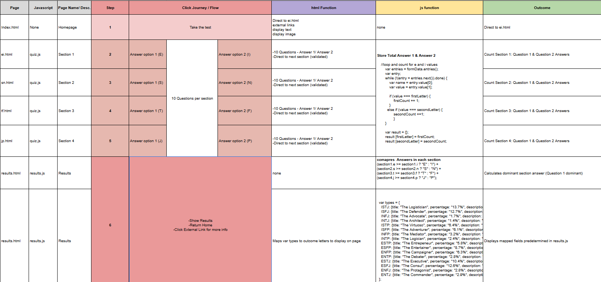

# The Myers Briggs Personality Index (MBTI) Test

The Myers Briggs Personality Index (MBTI) Test, is a psuedo psychology quiz developed during WWII to determine the users' personality groups based on introverted vs extroverted answers over 4 different sections. Based on the work of Carl Jung, it is a popular quiz for people to determine their personality group and though considered redundant professionally, it still provides a good insight to someones traits.

# Table of Contents

## UX

- [User Stories](#user-stories)

## Visual Design

- [Wireframes](#wireframes)
- [Index Page](#index-page)
- [Section Pages (ei.html, sn.html, tf.html, jp.html)](#section-pages-eihtml-snhtml-tfhtml-jphtml)
- [Results Page](#results-page)
- [Fonts](#fonts)
- [Colors](#colors)
- [Images](#images)
  - [Index Page MBTI Diagram](#index-page-mbti-diagram-sourced-from)
  - [MBTI Test](#mbti-test)
    - [ISTJ](#istj)
    - [ISFJ](#isfj)
    - [INFJ](#infj)
    - [INTJ](#intj)
    - [ISTP](#istp)
    - [ISFP](#isfp)
    - [INFP](#infp)
    - [INTP](#intp)
    - [ESTP](#estp)
    - [ESFP](#esfp)
    - [ENFP](#enfp)
    - [ENTP](#entp)
    - [ESTJ](#estj)
    - [ESFJ](#esfj)
    - [ENFJ](#enfj)
    - [ENTJ](#entj)
- [Styling](#styling)

## Page Elements

- [Homepage (index.html)](#homepage-indexhtml)
- [Section Pages Elements (ei.html, sn.html, tf.html, jp.html)](#section-pages-elements-eihtml-snhtml-tfhtml-jphtml)
- [Results Page (results.html)](#results-page-resultshtml)

## Javascript

- [Javascript Overview](#javascript-overview)
  - [quiz.js](#quizjs)
  - [results.js](#resultsjs)
  - [Function map](#function-map)

## Testing

- [User Testing](#user-testing)
- [General Testing](#general-testing)
- [User Stories Testing](#user-stories-testing)
- [Mobile Testing](#mobile-testing)
- [Desktop Testing](#desktop-testing)
- [Lighthouse Overview](#lighthouse-overview)
- [Issues Resolution/Acceptance](#issues-resolutionacceptance)

## Deployment

- [Local Deployment](#local-deployment)
  - [Local Preparation](#local-preparation)
- [Github Deployment](#github-deployment)
  - [Github Instructions](#github-instructions)

---

## UX

### User Stories

1. I want to learn about the history of the MBTI.
2. I want to understand the results before starting the test.
3. I want access to external sources.
4. I want to easily start the test.
5. I want validation if questions are skipped.
6. I want the test to work on all devices.
7. I want to return to the homepage easily.
8. I want the site to be visually accessible.

## Visual Design

### Wireframes

####

#### Index Page

#### Section Pages (ei.html, sn.html, tf.html, jp.html)

#### Section Pages Re-Design Flag:

The initial design had a single page for the test/quiz and was 70 questions long. It became clear during construction that this was poor UX so I decided to split it into the 4 pages corresponding to the different sections/pages.
The commit that corresponds to this is :
"added:redesign UX :html files to split existing sections to different pages"

#### Results Page

#### Fonts

- **Primary:** `Montserrat`, sans-serif – Bold and accessible for headings
- **Secondary:** `Varela`, sans-serif – Clean and minimalist for paragraph text

#### Colors

- Based on MBTI diagram used across multiple platforms
- Accessible color scheme with light backgrounds and high contrast

#### Images

#### Index Page MBTI Diagram sourced from (https://en.wikipedia.org/wiki/Myers%E2%80%93Briggs_Type_Indicator)

#### MBTI Test

#### Results Page Personality Type Images sourced from (https://16personalities.com)

### ISTJ

### ISFJ

### INFJ

### INTJ

### ISTP

### ISFP

### INFP

### INTP

### ESTP

### ESFP

### ENFP

### ENTP

### ESTJ

### ESFJ

### ENFJ

### ENTJ

### Styling

- Bootstrap 5 classes utilised as well as custom css (styles.css stylesheet). See page elements for more details.

## Page Elements

### Homepage (`index.html`)

#### **1. `<nav class="nav py-3 mb-4 custom-navbar">`**

- **Type:** HTML `<nav>` (navigation)
- **Bootstrap:**
  - `.nav` → Base navigation layout
  - `.py-3` → Vertical padding
  - `.mb-4` → Margin bottom
- **Custom CSS:** `custom-navbar`

##### **2. `
` (inside `<nav>`)**

- **Type:** HTML `
`
- **Bootstrap:** `.container` → Responsive fixed-width container

#### **3. `<a href="ei.html" class="btn btn-primary btn-lg">Take the test!</a>`**

- **Type:** HTML `<a>` (link)
- **Bootstrap:**
  - `.btn` → Button styling
  - `.btn-primary` → Primary theme color
  - `.btn-lg` → Large button size

#### **4. `
` (main heading card container)**

- **Type:** HTML `
`
- **Bootstrap:** `.container` → Responsive wrapper

#### **5. `
`**

- **Type:** HTML `
`
- **Bootstrap:** `.card` → Card component

#### **6. `
`**

- **Type:** HTML `
`
- **Bootstrap:** `.card-header` → Card header section

#### **7. `<h1>The Myers Briggs Type Indicator Test (MBTI)</h1>`**

- **Type:** HTML `<h1>`
- **Bootstrap:** _None_

#### **8. `
`**

- **Type:** HTML `
`
- **Bootstrap:** `.card-body` → Main content area for card

#### **9. `<h2 class="card-title">About the test</h2>`**

- **Type:** HTML `<h2>`
- **Bootstrap:** `.card-title` → Card title styling

#### **10. `
` (two instances)**

- **Type:** HTML `
`
- **Bootstrap:** `.card-text` → Standard card paragraph styling

#### **11. `<a href="..." target="_blank" class="btn btn-secondary">Visit the wikipedia page</a>`**

- **Type:** HTML `<a>` (link)
- **Bootstrap:**
  - `.btn` → Button styling
  - `.btn-secondary` → Secondary theme color

#### **12. `<section class="image-section text-center pt-3 pb-5">`**

- **Type:** HTML `<section>`
- **Bootstrap:**
  - `.text-center` → Center-aligned text
  - `.pt-3` → Padding top
  - `.pb-5` → Padding bottom
- **Custom CSS:** `image-section`

#### **13. `
` (inside image section)**

- **Type:** HTML `
`
- **Bootstrap:** `.container` → Responsive wrapper

#### **14. `<h3 class="mb-4">Diagram of Cognitive Functions in the MBTI</h3>`**

- **Type:** HTML `<h3>`
- **Bootstrap:** `.mb-4` → Bottom margin

#### **15. ``**

- **Type:** HTML ``
- **Bootstrap:**
  - `.img-fluid` → Responsive image scaling
  - `.rounded-4` → Large rounded corners
  - `.mb-3` → Bottom margin

#### **16. `
`**

- **Type:** HTML `
`
- **Bootstrap:** `.mb-3` → Bottom margin

#### **17. ``**

- **Type:** HTML ``
- **Bootstrap:**
  - `.d-inline-block` → Inline-block display
  - `.bg-light` → Light background color
  - `.text-dark` → Dark text color
  - `.px-2` → Horizontal padding
  - `.py-1` → Vertical padding
  - `.rounded` → Rounded corners

#### **18. `<small>... <a href="...">CC BY-SA 4.0</a></small>`**

- **Type:** HTML `<small>` with `<a>` (link)
- **Bootstrap:** _None_

#### **19. `<a href="ei.html" class="btn btn-secondary">Take the test!</a>`**

- **Type:** HTML `<a>` (link)
- **Bootstrap:**
  - `.btn` → Button styling
  - `.btn-secondary` → Secondary theme color

### **Section pages Elements (ei.html, sn.html, tf.html, jp.html)**

#### **1. `<nav class="nav py-3 mb-4 custom-navbar">`**

- **Function:** Top navigation bar containing a "Home" button.
- **Bootstrap:**
  - `.nav` → Applies Bootstrap nav styling.
  - `.py-3` → Adds vertical padding.
  - `.mb-4` → Adds bottom margin.
  - `.container` (inside) → Centers and limits content width.
  - `.btn`, `.btn-primary`, `.btn-lg` → Large primary-styled Bootstrap button.

####

**2. `
` (Heading Section)**

- **Function:** Displays the test title and section heading.
- **Bootstrap:** `.container` → Responsive fixed-width content wrapper.

#### **3. `<form id="quiz-form" class="needs-validation" novalidate>`**

- **Function:** Contains the test questions and handles input/validation.
- **Bootstrap:**
  - `.needs-validation` → Enables Bootstrap form validation styling.
  - Uses `.mb-3` inside for spacing between form elements.

#### **4. `
` (Question Container)**

- **Function:** Holds a set of questions and answer options.
- **Bootstrap:**
  - `.container` → Centers content.
  - `.mb-5` → Large bottom margin.

#### **5. `
` (Inside Question Block)**

- **Function:** Groups a single radio button with its label.
- **Bootstrap:** `.form-check` → Bootstrap form check/radio wrapper.

#### **6. `<input class="form-check-input" type="radio">`**

- **Function:** Radio button for selecting an answer.
- **Bootstrap:** `.form-check-input` → Styles the radio button.

#### **7. `<label class="form-check-label">`**

- **Function:** Label text for the radio button.
- **Bootstrap:** `.form-check-label` → Styles label positioning and spacing.

#### **8. `<button class="btn btn-primary mt-3">`**

- **Function:** Submit button for the quiz form.
- **Bootstrap:**
  - `.btn` → Base Bootstrap button style.
  - `.btn-primary` → Primary color style.
  - `.mt-3` → Top margin.

#### **9. `
` (Footer Area)**

- **Function:** Footer section with centered text.
- **Bootstrap:**
  - `.container` → Centers content.
  - `.text-center` → Centers text horizontally.
  - `.mt-5` → Adds space above.

### Results Page (results.html)

#### **1. `<nav class="nav py-3 mb-4 custom-navbar">`**

- **Type:** HTML `<nav>` (navigation)
- **Bootstrap:**
  - `.nav` → Base navigation layout
  - `.py-3` → Vertical padding
  - `.mb-4` → Margin bottom
- **Custom CSS:** `custom-navbar`

#### **2. `
` (inside `<nav>`)**

- **Type:** HTML `
`
- **Bootstrap:** `.container` → Responsive fixed-width container

#### **3. `<a href="index.html" class="btn btn-primary btn-lg">Home</a>`**

- **Type:** HTML `<a>` (link)
- **Bootstrap:**
  - `.btn` → Button styling
  - `.btn-primary` → Primary theme color
  - `.btn-lg` → Large button size

#### **4. `
`**

- **Type:** HTML `
`
- **Bootstrap:**
  - `.container` → Responsive wrapper
  - `.text-center` → Center-aligned text

#### **5. `<h1>Your MBTI Type: </h1>`**

- **Type:** HTML `<h1>` with `` for dynamic text
- **Bootstrap:** _None_

#### **6. `<h2 id="title" class="mt-3"></h2>`**

- **Type:** HTML `<h2>`
- **Bootstrap:** `.mt-3` → Top margin

#### **7. `
<strong>Percentage of population:</strong> 
`**

- **Type:** HTML `
` with `<strong>` and ``
- **Bootstrap:** _None_

#### **8. `

`**

- **Type:** HTML `
`
- **Bootstrap:** _None_

#### **9. `
<a id="site" href="#" target="_blank">Learn more about this type</a>
`**

- **Type:** HTML `
` with `<a>` (link)
- **Bootstrap:** _None_

#### **10. ``**

- **Type:** HTML ``
- **Bootstrap:**
  - `.img-fluid` → Responsive image scaling
  - `.my-4` → Vertical margin

#### **11. `
`**

- **Type:** HTML `
`
- **Bootstrap:** `.mb-3` → Bottom margin

#### **12. ``**

- **Type:** HTML ``
- **Bootstrap:**
  - `.d-inline-block` → Inline-block display
  - `.bg-light` → Light background color
  - `.text-dark` → Dark text color
  - `.px-2` → Horizontal padding
  - `.py-1` → Vertical padding
  - `.rounded` → Rounded corners

#### **13. `<small>Illustration and content by <a href="...">16Personalities.com</a></small>`**

- **Type:** HTML `<small>` with `<a>` (link)
- **Bootstrap:** _None_

#### **14. ``**

- **Type:** HTML `<script>` (JavaScript loader)

## Javascript

### Javascript Overview

There are 2 seperate javascript files: quiz.js and results.js. The main purpose of the javascript is to collect results from each section, then display preset text and image outputs in the results based off the results from the sections, it is also used for form validation in the quiz-form portion of the site:

#### quiz.js

Is applied to all the test section pages (ei.html, sn.html, tf.html, jp.html) its functions are as follows:

- Uses DOMContentLoaded so the script runs only after all HTML elements are available.
- Selects key elements from the page: form, sectionkey (corresponding to each section page) , feedback image (placeholder for future developmenet, validation message (for use with bootstrap validation).
- Maps section keys (section1, section2, etc.) to the two answer options that should be counted for that section:
- Prevents the default page reload (e.preventDefault()).
- Adds the Bootstrap validation class "was-validated" to visually show field errors.
- If form is invalid - Shows the validation message (validationMsg.style.display = "block")
- If form is valid - Hides the validation message
- Uses FormData(form) to collect all form inputs (For final score)
- Counts how many times each letter was chosen
- stores the results - Creates an object like { e: 3, i: 7 } for that section.
- Redirects the browser to that next page. _ html redirect not used to prevent this running before the script ends_

#### results.js

Is applied to results.html and it's function is as follows:

- Uses DOMContentLoaded to ensure all HTML elements are available before running the script.
- Creates an object types where each key is an MBTI code (e.g., "ISTJ") and the value is an object containing: title – personality type name, percentage – approximate percentage of the population with that type, description – short traits summary, site – link to more info (16Personalities.com), image – URL to the type’s image.
  -Loads JSON‑formatted counts from sessionStorage for: section1, section2, section3, section4
- validates stored results
- Compares counts for each section: Picks the letter with the greater count.\* Uses >= so the first option wins if there’s a tie (to prevent split answers)
- Finds the corresponding data from the types object based on the determined MBTI type.
  -Populates the results page with: The 4‑letter type, Personality title, Percentage of population, Description ,Link to more info ,Image source and alt text.

#### Function map

This is a visual to show the click journey of the user along with its html and js key steps ([please note only top line script is displayed for overview purposes]

## Testing

### User Testing

### General Testing

- The site was sent to friends for feedback and testing.
- All forms have validation and will not submit without the proper information.
- Youtube Video embed functionality tested.
- Map interaction controls fully tested.
- External links open in a new tab.
- Font and color placement.
- Image resolutions intrinsic vs rendered checekd.
- adhoc troubleshooting with the aid of Code Institute Network and https://www.stackoverflow.com.

### User Stories Testing

1. I want to learn about the history of the MBTI.

- Homepage header card provides background and information about the test.

2. I want to understand the results before starting the test.

- MBTI Diagram image as well as Wikipedia link provides overview of this.

3. I want access to external sources.

- Acheived via wikipedia links in the homepage and also the 16personalities link at the results page.

4. I want to easily start the test.

- Acheived via homepage with button#1 in the navigation to be in landing view, then also button#2 below the image for scrolled-down access.

5. I want validation if questions are skipped.

- Bootstrap validation and backup javascript applied to the test pages.

6. I want the test to work on all devices.

- As well as a simple layout. Also utilised bootstrap classes and media queries to scale easily.

7. I want to return to the homepage easily.

- Homepage button in all non-index pages in the navigation.

8. I want the site to be visually accessible.

- simple design with well contrasted background vs foreground. Lighthouse accessibility good scores.

### Mobile Testing

- I tested the site personally on my Android Galaxy S24 device, going through the entire process, checking buttons, functions out, etc. I was personally unable to test on iOS.
- The site was sent to friends and relatives for them to follow the same process. They have tested on their devices, including iOS.
- Chrome was utilised to inspect the site in mobile format, going through the pages and functions.

### Desktop Testing

- The majority of testing occurred on Chrome.
- The site was tested by friends and relatives on numerous desktop devices.
- The sites functionality and navigation have been tested on Chrome, Firefox and Edge.
- Internet Explorer was not tested and the site was not developed with it in mind as support for the browser is gradually being dropped.

### Lighthouse Overview

Any remaining flags in the lighthouse reports are due to external sources so are neglegible.
There is also a remaining flag of contrast in foreground vs background however, as this is on the legal disclaimer for external image use; this is also negligable.

Index page
Desktop

Mobile

ei (section 1) page
Desktop

Mobile

sn (section 2) page
Desktop

Mobile

tf (section 3) page
Desktop

Mobile

jp (section 4) page
Desktop

Mobile

Issues Resolution/ Acceptance

Issue: background vs foreground text low contrast
Acceptance Reason: text is for legal purposes only, no impact to UX.

Issue: Issues logged in panel
Acceptance Reason: 3rd Party Cookie - not in scope.

Issue: explicit height and width not set
Resolution: set explicit width and height to images on index & results page.
Commit message: lighthouse fix: index, results page - explicit height and width

## Deployment

### Local Deployment

#### Local Preparation

**Requirements:**

- An IDE of your choice, such as [Visual Studio Code](https://code.visualstudio.com/)
- Github Account

### Github Deployment

#### Github Instructions

1. Log in to your GitHub account.
   navigate to [https://github.com/Ri-Dearg/neverlost-thrift\](https://github.com/JamesBirchall-dev/Invital-Health-Centre](https://github.com/JamesBirchall-dev/MSP2))](https://github.com/JamesBirchall-dev/MSP2).
1. You can set up your own repository and copy or clone it, or you fork the repository.
1. `git add`, `git commit` and `git push` to a GitHub repository, if necessary.
1. GitHub pages will update from the master branch by default.
1. Go to the **Settings** page of the repository.
1. Scroll down to the **Github Pages** section.
1. Select the Master Branch as the source and **Confirm** the selection.
1. Wait a minute or two and it should be live for viewing. See my own [here](https://jamesbirchall-dev.github.io/MSP2/).

### Credits and Contact

#### Content

- code template for MBTI test https://codepen.io/pulpexploder/pen/pNpdeq/)
- Wikipedia – MBTI(https://en.wikipedia.org/wiki/Myers%E2%80%93Briggs_Type_Indicator)
- 16Personalities.com (https://www.16personalities.com/)
- Bootstrap Documentation (https://getbootstrap.com/docs/5.3/getting-started/introduction/)
- Code Institute(https://learn.codeinstitute.net/)
- W3 Schools (https://www.w3schools.com/js/js_quiz.asp)

#### Contact

Please feel free to contact me at `jamesbdorel@gmail.com`
